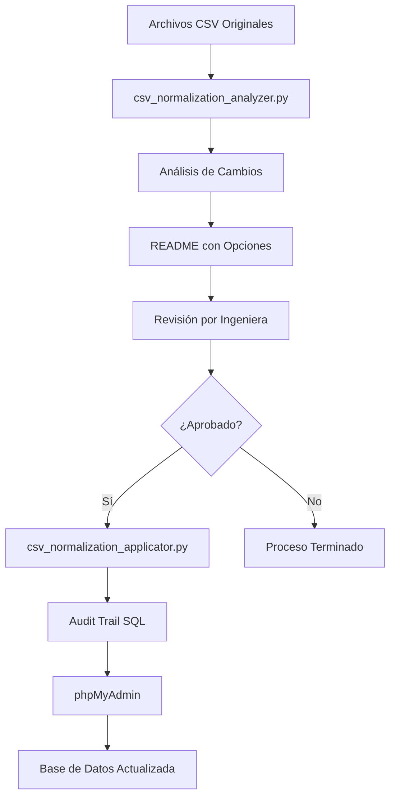

# Sistema de Análisis y Trazabilidad de Cambios en Normalización CSV

**Sistema SBL - Validación de Instrumentos**  
**Versión 1.0 - Septiembre 2025**

---

## 🎯 Descripción General

Este sistema automatizado permite detectar, analizar y aplicar de manera controlada todos los cambios realizados durante la normalización de archivos CSV originales del sistema de validación de instrumentos. 

**Objetivo Principal:** Garantizar la trazabilidad completa mediante audit trail y mantener el control de calidad requiriendo aprobación manual de las ingenieras para cambios críticos.

**Beneficios:**
- ✅ Trazabilidad completa de modificaciones
- ✅ Control de calidad mediante aprobación manual
- ✅ Cumplimiento con estándares de audit trail
- ✅ Reducción de errores manuales
- ✅ Documentación automática de cambios

## 📋 Componentes del Sistema

### 1. `csv_normalization_analyzer.py` - Analizador de Cambios
**Función:** Detecta y analiza automáticamente todos los cambios que se realizarían durante la normalización.

**Características:**
- ✅ Detecta homologación de términos
- ✅ Identifica correcciones ortográficas
- ✅ Analiza normalización de formatos
- ✅ Clasifica cambios por nivel de impacto
- ✅ Genera reportes detallados para aprobación

### 2. `csv_normalization_applicator.py` - Aplicador de Cambios
**Función:** Aplica únicamente los cambios aprobados y genera el audit trail correspondiente.

**Características:**
- ✅ Lee aprobaciones del README generado
- ✅ Aplica solo cambios autorizados
- ✅ Genera audit trail con datos de la ingeniera
- ✅ Crea SQL compatible con phpMyAdmin
- ✅ Mantiene trazabilidad completa

## 🔄 Flujo de Trabajo



## 🚀 Instrucciones de Uso

### Paso 1: Análisis de Cambios
**Ejecutado por:** Administrador del Sistema  
**Comando:** `python tools/scripts/csv_normalization_analyzer.py`

**Archivos generados automáticamente:**
- `analisis_cambios_YYYYMMDD_HHMMSS.json` - Análisis técnico detallado
- `propuesta_audit_trail_YYYYMMDD_HHMMSS.sql` - Propuesta SQL inicial
- `README_cambios_YYYYMMDD_HHMMSS.md` - **📋 ARCHIVO PRINCIPAL PARA REVISIÓN**
- `resumen_ejecutivo_YYYYMMDD_HHMMSS.md` - Resumen ejecutivo para gerencia

> **Nota:** El administrador del sistema entregará estos archivos a las ingenieras para su revisión.

### Paso 2: Revisión y Aprobación por Ingeniera
**Responsable:** Ingeniera de Validación Designada

**Proceso de Revisión:**
1. **Recibir** el archivo `README_cambios_YYYYMMDD_HHMMSS.md` del administrador
2. **Revisar** cada regla de cambio propuesta y sus ejemplos
3. **Evaluar** el impacto de cada cambio en la calidad de los datos
4. **Marcar** las decisiones usando la siguiente notación:
   - `[x] ✅ APROBAR` - Para aprobar la regla tal como está propuesta
   - `[x] ❌ RECHAZAR` - Para rechazar completamente la regla
   - `[x] 🔧 MODIFICAR` - Para aprobar con modificaciones (especificar en comentarios)

5. **OBLIGATORIO - Completar la sección de responsabilidad:**
```markdown
## 👩‍🔬 Sección de Aprobación

**Ingeniera Responsable:**
- Nombre: [NOMBRE COMPLETO DE LA INGENIERA]
- Correo: [EMAIL@sblpharma.com]
- Firma: [FIRMA DIGITAL O IDENTIFICADOR ÚNICO]
- Fecha: [YYYY-MM-DD]

**Decisión Final:**
- [x] Aprobar cambios seleccionados arriba
```

6. **Entregar** el archivo completado de vuelta al administrador del sistema

### Paso 3: Aplicación de Cambios Aprobados
**Ejecutado por:** Administrador del Sistema  
**Comando:** `python tools/scripts/csv_normalization_applicator.py`

**Requisito:** Debe tener el archivo README completado por la ingeniera

**Archivos generados:**
- `insert_audit_trail_SC.sql` - **📄 ARCHIVO FINAL PARA BASE DE DATOS**
- `resumen_cambios_aplicados_YYYYMMDD_HHMMSS.md` - Reporte de ejecución

### Paso 4: Actualización de Base de Datos
**Ejecutado por:** Administrador del Sistema

**Proceso:**
1. **Abrir** phpMyAdmin
2. **Seleccionar** la base de datos del sistema SBL
3. **Importar** el archivo `insert_audit_trail_SC.sql`
4. **Verificar** que los registros se insertaron correctamente ejecutando la consulta de verificación incluida
5. **Confirmar** con COMMIT solo después de verificar los datos

> **⚠️ IMPORTANTE:** El archivo SQL incluye transacciones para seguridad. Solo confirmar después de verificar.

## 📊 Tipos de Cambios Detectados

### 🔄 Homologación de Términos
| Tipo | Ejemplos | Impacto | Aprobación |
|------|----------|---------|------------|
| Unidades de temperatura | `grados C` → `°C` | Bajo | Automática |
| Unidades de presión | `kg/cm2` → `kg/cm²` | Bajo | Automática |
| Estados de instrumentos | `activo` → `Activo` | Medio | **Manual** |
| Estados de calibración | `calibrado` → `Calibrado` | Medio | **Manual** |

### ✏️ Corrección Ortográfica
| Tipo | Ejemplos | Impacto | Aprobación |
|------|----------|---------|------------|
| Errores comunes | `termometro` → `termómetro` | Bajo | Automática |
| Acentos técnicos | `calibracion` → `calibración` | Bajo | Automática |

### 📐 Normalización de Formato
| Tipo | Ejemplos | Impacto | Aprobación |
|------|----------|---------|------------|
| Fechas | `15/03/2024` → `2024-03-15` | Alto | **Manual** |
| Precisión numérica | `25.456789` → `25.46` | Medio | **Manual** |
| Espacios en blanco | `  texto   ` → `texto` | Bajo | Automática |

## 🔍 Estructura del Audit Trail

Cada cambio aprobado genera un registro con esta estructura:

```sql
INSERT INTO audit_trail (
    empresa_id,                 -- ID de la empresa (1)
    segmento_actor,            -- 'Ingenieras de Validación'
    fecha_evento,              -- Timestamp del cambio
    seccion,                   -- 'Normalización CSV - [archivo]'
    rango_referencia,          -- Referencia de celda Excel (ej: 'B15')
    instrumento_id,            -- NULL (se determinará después)
    valor_anterior,            -- Valor original
    valor_nuevo,               -- Valor normalizado
    usuario_id,                -- NULL (se determinará después)
    usuario_correo,            -- Email de la ingeniera aprobadora
    usuario_nombre,            -- Nombre de la ingeniera aprobadora
    usuario_firma_interna,     -- Firma de la ingeniera
    instrumento_codigo,        -- NULL (se determinará después)
    columna_excel,             -- Letra de columna Excel (ej: 'B')
    fila_excel                 -- Número de fila Excel
) VALUES (...);
```

## 📁 Estructura de Archivos

```
SBL_SISTEMA_INTERNO/
├── app/Modules/Internal/ArchivosSql/
│   ├── Archivos_CSV_originales/           # CSVs fuente
│   ├── Archivos_Normalize/                # CSVs procesados
│   └── Archivos_BD_SBL/SBL_inserts/      # SQLs finales
│       └── insert_audit_trail_SC.sql      # ← ARCHIVO FINAL
├── tools/
│   ├── scripts/
│   │   ├── csv_normalization_analyzer.py  # ← SCRIPT 1
│   │   └── csv_normalization_applicator.py # ← SCRIPT 2
│   └── analysis_results/                   # Archivos de análisis
│       ├── analisis_cambios_*.json
│       ├── README_cambios_*.md            # ← PARA APROBAR
│       ├── resumen_ejecutivo_*.md
│       └── resumen_cambios_aplicados_*.md
```

## ⚠️ Consideraciones Importantes

### Responsabilidades del Proceso

**Administrador del Sistema:**
- Ejecutar los scripts de análisis y aplicación
- Entregar archivos de revisión a las ingenieras
- Realizar importación final en base de datos
- Mantener respaldos de todas las decisiones

**Ingeniera de Validación:**
- Revisar técnicamente cada cambio propuesto
- Tomar decisiones informadas sobre aprobación/rechazo
- Asumir responsabilidad técnica de los cambios aprobados
- Completar obligatoriamente sus datos de identificación

### Seguridad y Trazabilidad
- ✅ **Identificación obligatoria** de la ingeniera responsable
- ✅ **Aprobación manual explícita** para cambios críticos
- ✅ **Audit trail completo** registrado en base de datos
- ✅ **Respaldo permanente** de todas las decisiones
- ✅ **Transacciones seguras** con posibilidad de rollback

### Clasificación de Impacto de Cambios

| Nivel | Descripción | Ejemplos | Aprobación |
|-------|-------------|----------|------------|
| **🟢 BAJO** | Cambios cosméticos sin impacto funcional | Espacios, formato de texto | Puede ser automática |
| **🟡 MEDIO** | Cambios que pueden afectar interpretación | Estados, unidades | **Requiere aprobación** |
| **🔴 ALTO** | Cambios en valores críticos o formatos | Fechas, precisión numérica | **Requiere aprobación** |

## 🛠️ Configuración Avanzada

### Personalizar Reglas de Normalización

Para agregar nuevas reglas, editar en `csv_normalization_analyzer.py`:

```python
def _load_homologation_rules(self):
    rules = {
        "nueva_regla": ChangeRule(
            rule_id="HOM005",
            rule_type="homologation",
            description="Descripción de la nueva regla",
            pattern=r"patrón_regex",
            replacement="reemplazo",
            confidence=0.90,
            examples=["ejemplo1 → resultado1"],
            impact_level="medium",  # low, medium, high
            requires_approval=True  # True para aprobación manual
        )
    }
```

### Personalizar Formato de Audit Trail

Editar la función `generate_audit_trail_sql()` en `csv_normalization_applicator.py` para modificar:
- Estructura de campos
- Formato de valores
- Agrupación de registros

## � Lista de Verificación para Ingenieras

Antes de aprobar cambios, verificar:

- [ ] **Revisar ejemplos** de cada regla propuesta
- [ ] **Evaluar impacto** en la calidad de datos
- [ ] **Considerar** efectos en reportes existentes
- [ ] **Verificar** compatibilidad con procedimientos actuales
- [ ] **Completar** todos los datos de identificación personal
- [ ] **Marcar claramente** cada decisión de aprobación/rechazo

## 🔄 Flujo de Comunicación

1. **Administrador → Ingeniera:** Entrega archivos de análisis
2. **Ingeniera:** Revisa y completa aprobaciones (24-48 hrs)
3. **Ingeniera → Administrador:** Regresa archivo completado
4. **Administrador:** Ejecuta cambios aprobados
5. **Administrador → Ingeniera:** Confirma aplicación exitosa

## 📞 Contacto y Soporte

**Para Ingenieras:**
- Dudas técnicas sobre cambios: Contactar administrador del sistema
- Interpretación de reglas: Revisar ejemplos en el archivo de análisis
- Urgencias: Coordinar directamente con administrador

**Para Administrador del Sistema:**
- Errores de ejecución: Revisar logs en `tools/analysis_results/`
- Problemas de archivos: Verificar permisos y rutas
- Actualizaciones del sistema: Documentar en changelog

## 📝 Historial de Versiones

| Versión | Fecha | Descripción | Responsable |
|---------|-------|-------------|-------------|
| **1.0** | Sep 2025 | Versión inicial del sistema | Administrador del Sistema |
| **1.1** | _Pendiente_ | Mejoras basadas en feedback | Administrador del Sistema |

---

**Sistema SBL - Validación de Instrumentos**  
**Documento técnico v1.0 - Septiembre 2025**  
*Para uso interno del equipo de validación*